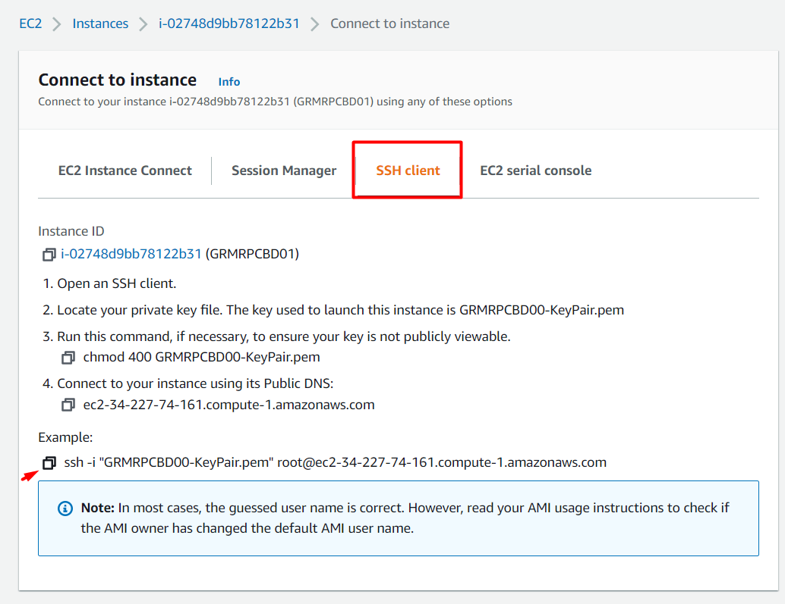
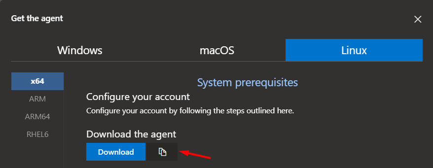
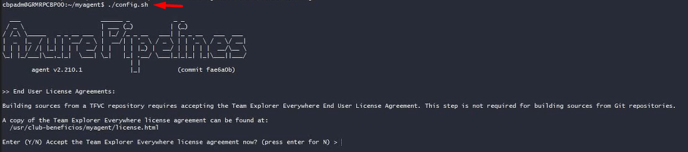
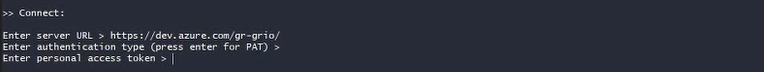

### Creación de un agent pool y conexión

Nota: Si no eres usuario root agregar **sudo** en algunos comandos.

1. Copiar la conexión
   

2. Escribirlo en tu terminal o bash:
   

3. Verificar que estés dentro de la carpeta club-beneficios: **pwd**
   

4. Crear una carpeta para tu agente:
```bash
    mkdir /myagent
```
5. Moverme a la carpeta creada:
```bash
    cd /myagent/
```
6. Descargar el agente
```bash
    wget https://vstsagentpackage.azureedge.net/agent/2.210.1/vsts-agent-win-x64-2.210.1.zip
``` 
   

7.  Ejecutar el archivo del agente:
```bash
    tar zxvf vsts-agent-linux-x64-2.210.1.tar.gz
``` 

8. Ejecutar el agente:
```bash
    ./config.sh
``` 
   

9. Enter server URL:
```bash
    https://dev.azure.com/gr-grio/
``` 
10. Crear el access tokken en azure DevOps y escribirlo en el bash:
    

11. Escribir el nombre del pool creado en azure DevOps:
    

12. Escribir el nombre de tu agente:
    

13. Inciar el agente en linux:
```bash
    ./run.sh
```
   

**Comandos para que el agent pool actue como un servicio:**
```bash
    sudo ./svc.sh install [nombre_user]
```
Ver el estado:
```bash
    sudo ./svc.sh status
```
Comenzar:
```bash
    sudo ./svc.sh start
``` 
Detener:
```bash
    sudo ./svc.sh stop
``` 
Desinstalar:
```bash
    sudo ./svc.sh stop
```
Para habilitar que se inicie cada vez que inicie el servicio EC2:
```bash
    sudo systemctl enable vsts.agent.gr\x2dgrio.GRMROPCBD02.agent02_ubuntu.service
```
Para solo hacer que corra una vez:
```bash
    ./run.sh --once
```

**ELiminar y volver a configurar un agente**
```bash
    ./config.sh remove
```

#### ERRORES ENCONTRADOS

**No usable version of libssl was found**
Links: Descargar el archivo, pero debe ser acorde a su arquitectura.
https://forum.unity.com/threads/workaround-for-libssl-issue-on-ubuntu-22-04.1271405/
http://security.ubuntu.com/ubuntu/pool/main/o/openssl1.0/

Después ejecutar:
```bash
    sudo dpkg -i libssl1.0.0_1.0.2n-1ubuntu5.10_amd64.deb
```

posiblemente de un nuevo error:
 **The SSL connection could not be established, see inner exception**. Ejecutar:
```bash
    export AZP_AGENT_USE_LEGACY_HTTP=true
```
##### Otros Comandos:

Copiar un archivo de windows a linux:
```bash
    scp -i GRMROPCBD02.pem D:/archivos_grio/libssl1.0.0_1.0.2n-1ubuntu5.10_amd64.deb ubuntu@ec2-3-90-36-252.compute-1.amazonaws.com:/myagent
```

Darle los permisos a myagent
```bash
    chmod -R 777 myagent
```

