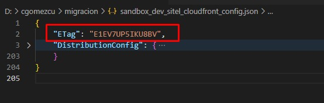
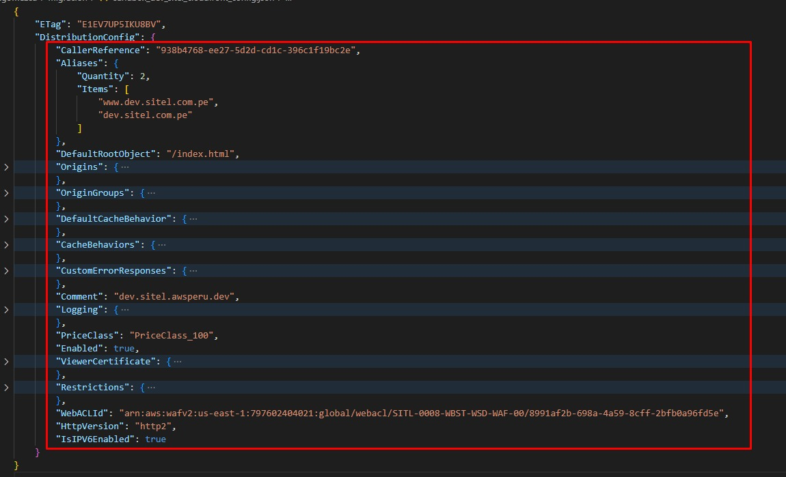

### 1. SITEL CORPORATIVO

#### 1.1 Certificate Manager

<sub> 1.1.1 Crear certificado para nuevo dominio alterno awsperu.dev

    Dominios:
        - sitel.awsperu.dev 
        - www.sitel.awsperu.dev 
        - *.sitel.awsperu.dev
  
``` bash
aws acm request-certificate --domain-name sitel.awsperu.dev --validation-method DNS --subject-alternative-names www.sitel.awsperu.dev *.sitel.awsperu.dev
```

<sub> 1.1.2. Copiar el **ARN** generado en la creación del certificado
``` bash
 { "CertificateArn": }
``` 

<sub> 1.1.3. Obtener CNAMES del certificado creado y pasarlo a un archivo .json, es necesario proporcionar el **ARN** del certificado.
``` shell
aws acm describe-certificate --certificate-arn **ARN**
``` 

<sub> 1.1.4. Copiar los **CNAMES** y pegarlos en el proveedor de dominio (godaddy)

<sub> 1.1.5. Esperar la validación del certificado.

#### 1.2 CloudFront

<sub> 1.2.1. Obtener el **ID** de la distribución. </sub>
```bash
aws cloudfront list-distributions
```

<sub> 1.2.2. Registrar la distribución en Godaddy. </sub>


<sub> 1.2.3. Actualizar el **MAIN** del Bucket. </sub>

```bash
aws s3 sync s3://excl-0008-wbst-wsp-00/frontend .
```

<sub> 1.2.4. Obtener información del CloudFront, es necesario proporcionar el **CLOUDFRONT_ID**. </sub>

```bash
aws cloudfront get-distribution-config --id **CLOUDFRONT_ID** > sandbox_prd_sitel_cloudfront_config.json
```
<sub> 1.2.5. Copiar el valor de **ETAG** en la primera linea



<sub> 1.2.6. Editar borrando la primera llave (No enviar dentro del json ETag, Distribution), armar un nuevo archivo sandbox_prd_sitel_cloudfront.json con un nuevo contenido donde se modifque los item de **Aliases** - **ARN** y **Comment**.



<sub> 1.2.7. Ejecutar la actualización del CloudFront con los nuevos dominios y certificado, es necesario proporcionar el **CLOUDFRONT_ID** y el **ETAG**.
```bash
aws cloudfront update-distribution --distribution-config file://sandbox_prd_sitel_cloudfront.json --id **CLOUDFRONT_ID** --if-match **ETAG**
```

---

### 2. SITEL
#### 2.1 Certificate Manager

<sub> 2.1.1. Eliminar el Cloudfront con el proveedor del dominio.

<sub> 2.1.2. Eliminar Certificado, es necesario proporcionar el **ARN** del certificado.
        
``` bash
aws acm delete-certificate --certificate-arn **ARN**
```

<sub> 2.1.3. Crear Certificado

    Dominios:
        - sitel.com.pe
        - *.sitel.com.pe
        - www.sitel.com.pe
        - apiprd.sitel.com.pe
                
``` bash
aws acm request-certificate --domain-name sitel.com.pe --validation-method DNS --subject-alternative-names *.sitel.com.pe www.sitel.com.pe apiprd.sitel.com.pe
```

<sub> 2.1.4. Esperar la validación del certificado

<sub> 2.1.5. Actualizar el **ARN** del certificado

<sub> 2.1.6. Correr el CloudFormation, realizar el Pull Requets.

<sub> 2.1.7. Actualizar las variables de la libreria **PRD** con los **OUTPUTS** del CloudFormation

<sub> 2.1.8. Realizar los **PULL REQUETS** de las aplicaciones (lambdas y front).

<sub> 2.1.9. Ejecutar pipeline **MIGRACIÓN COGNITO**.

<sub> 2.1.10. Ejecutar pipeline **MIGRACIÓN DYNAMO**.

<sub> 2.1.11. Ejecutar pipeline **MIGRACIÓN MATCH_COGNITO_DYNAMO**.

<sub> 2.1.12. Ejecutar pipeline **BUCKET** con parámetro **PRD**.

