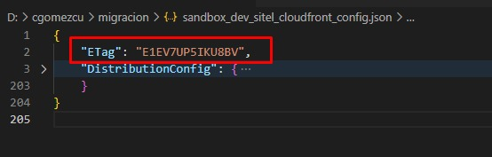
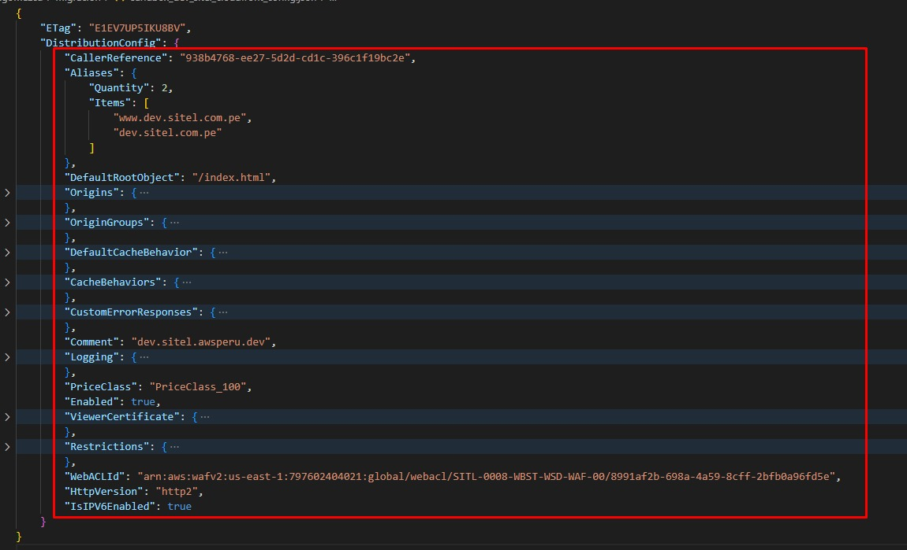

### 1. SITEL CORPORATIVO

#### 1.1 Certificate Manager

<sub> 1.1.1 Crear certificado para nuevo dominio alterno awsperu.dev

    Dominios:
        - qa.sitel.awsperu.dev
        - www.qa.sitel.awsperu.dev
        - *.qa.sitel.awsperu.dev
  
``` bash
aws acm request-certificate --domain-name qa.sitel.awsperu.dev --validation-method DNS --subject-alternative-names www.qa.sitel.awsperu.dev *.qa.sitel.awsperu.dev
```

<sub> 1.1.2. Copiar el **ARN** generado en la creación del certificado
``` bash
 { "CertificateArn": "arn:aws:acm:us-east-1:797602404021:certificate/8c23bb1d-243c-46f7-aa3b-48d7388d4d8b" }
``` 

<sub> 1.1.3. Obtener CNAMES del certificado creado y pasarlo a un archivo .json, es necesario proporcionar el **ARN** del certificado.
``` shell
aws acm describe-certificate --certificate-arn **ARN**
``` 

<sub> 1.1.4. Copiar los **CNAMES** y pegarlos en el proveedor de dominio (godaddy)

<sub> 1.1.5. Esperar la validación del certificado.

#### 1.2 CloudFront
<sub> 1.2.1. Obtener información del CloudFront, es necesario proporcionar el **CLOUDFRONT_ID**. </sub>

```bash
aws cloudfront get-distribution-config --id **CLOUDFRONT_ID** > sandbox_qa_sitel_cloudfront_config.json
```
<sub> 1.2.2. Copiar el valor de **ETAG** en la primera linea



<sub> 1.2.3. Editar borrando la primera llave (No enviar dentro del json ETag, Distribution), armar un nuevo archivo sandbox_qa_sitel_cloudfront.json con el siguiente contenido.



<sub> 1.2.4. Ejecutar la actualización del CloudFront con los nuevos dominios y certificado, es necesario proporcionar el **CLOUDFRONT_ID** y el **ETAG**.
```bash
aws cloudfront update-distribution --distribution-config file://sandbox_qa_sitel_cloudfront.json --id **CLOUDFRONT_ID** --if-match **ETAG**
```

---

### 2. SITEL
#### 2.1 Certificate Manager

<sub> 2.1.1. Eliminar Certificado, es necesario proporcionar el **ARN** del certificado.
        
``` bash
aws acm delete-certificate --certificate-arn **ARN**
```

<sub> 2.1.2. Crear Certificado

    Dominios:
        - qa.sitel.com.pe
        - *.qa.sitel.com.pe
        - www.qa.sitel.com.pe
        - apiqa.sitel.com.pe
                
``` bash
aws acm request-certificate --domain-name qa.sitel.com.pe --validation-method DNS --subject-alternative-names *.qa.sitel.com.pe www.qa.sitel.com.pe apiqa.sitel.com.pe
```

<sub> 2.1.3. Esperar la validación del certificado

<sub> 2.1.4. Actualizar el **ARN** del certificado

<sub> 2.1.5. Correr el CloudFormation

<sub> 2.1.6. Actualizar las variables de la libreria **QAS** con los **OUTPUTS** del CloudFormation

<sub> 2.1.7. Realizar los **PULL REQUETS** de las aplicaciones (lambdas y front).

<sub> 2.1.8. Ejecutar pipeline **MIGRACIÓN COGNITO**.

<sub> 2.1.9. Ejecutar pipeline **MIGRACIÓN DYNAMO**.

<sub> 2.1.10. Ejecutar pipeline **MIGRACIÓN MATCH_COGNITO_DYNAMO**.

<sub> 2.1.8. Ejecutar pipeline **BUCKET** con parámetro **QAS**.

